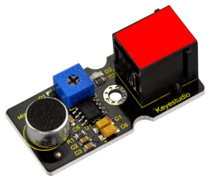
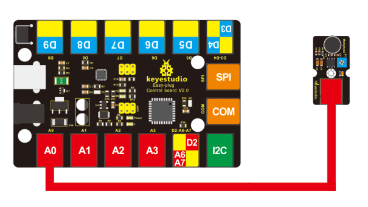

# KS0105 keyestudio EASY plug Analog Sound Sensor



## 1. Introduction

This sound sensor is typically used in detecting the loudness in ambient environment.You can use it to make interactive circuits such as a voice-operated switch.

The sound sensitivity can be adjusted by the potentiometer. The sensor comes with a fixed hole, easy for fixation on other devices.

This module should be used together with EASY plug control board.

**Special Note:**

The sensor/module is equipped with the RJ11 6P6C interface, compatible with our keyestudio EASY plug Control Board with RJ11 6P6C interface.

If you have the control board of other brands, it is also equipped with the RJ11 6P6C interface but has different internal line sequence, can’t be used compatibly with our sensor/module.

## 2. Specification

- Sensor type: Analog
- Supply Voltage: 3.3V to 5V
- Operating current：<10mA
- Output signal： analog signal

## 3. Technical Details

- Dimensions: 42mm * 20mm * 18mm
- Weight: 6.0g

## 4. Connect It Up

Connect the EASY Plug sound sensor to control board using an RJ11 cable. Then connect the control board to your PC with a USB cable.



## 5. Upload the Code

Download code:   [Code](./Code.7z)

```c
void setup()
{
	Serial.begin(9600);// open serial port, set the baud rate to 9600 bps
}

void loop()
{
    int val;
    val=analogRead(0); //connect mic sensor to Analog 0
    Serial.println(val,DEC);// print the sound value on serial monitor      
    delay(100);
}
```

## 6. Result

After uploading the code, open the serial monitor and set the baud rate to 9600, you should see the analog value showed on the monitor. 

